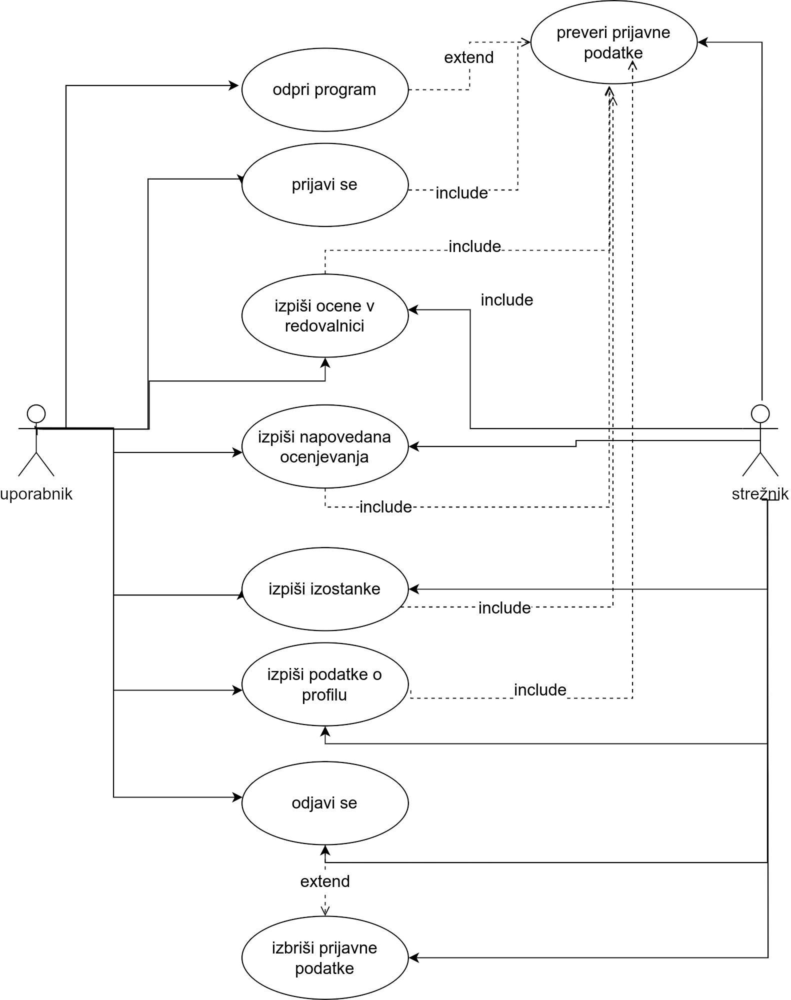

# Maturitetna naloga Mobilni odjemalec za storitev eAsistent

## Struktura projekta

## Moji zapiski za predstavitev naloge s številkami diapozitivov

1. Pozdravljeni, predstavil vam bom moj maturitetni projekt `Mobilni odjemalec za storitev eAsistent`.
2. Ogledali si bomo uporabljene tehnologije, strukturo programa, njegov vmesnik, testiranje in predviden nadaljni razvoj, na koncu pa bo čas za morebitna vprašanja.
3. Uporabljene tehnologije.
4. `Android` je operacijski sistem za pametne telefone s prilagojenim Linux jedrom. Je odprtokoden, kar prispeva k velikemu deležu uporabe na trgu. Sprva je bil namenjen za fotoaparate, danes pa je nameščen na več kot 70% pametnih telefonov po vsem svetu.
5. `Android Studio` je uradno razvojno orodje za razvoj aplikacij za Android. Razvijata ga podjetji Google in JetBrains. Vključuje vse potrebno za pisanje, razhroščevanje, testiranje, prevajanje in poganjanje kode. Vključuje tudi posnemovalnik sistema Android, v katerem lahko poženemo program, če nimamo Android naprave, oziroma, če želimo imeti več vpogleda v delovanje sistema. Je tudi odprokodno.
6. `XML` je konfiguracijski format, ki se pogosto uporablja pri razvoju aplikacij za sistem Android. Z njim lahko definiramo postavitev elementov, barve in statično besedilo, ki ga lahko kasneje enostavno prevedemo. V kodi se do elementov v XML, ki se nahajajo v mapi res, dostopa z razredom R.
7. `JSON` je format za shranjevanje in prenos podatkov. Je človeku berljiv in ni kodiran.  Pogosto se uporablja za prenos podatkov s strežnika na spletno stran, zaradi česar je priljubljena izbira za spletne aplikacije in aplikacijske vmesnike. Vanj je mogoče shraniti različne podatkovne tipe, kot so npr. logične vrednosti, nizi, števila, seznami... Dosledno se pošilja v obliki niza, kar omogoča lažjo serializacijo oz. pretvorbo v podatkovne tipe posameznega programskega jezika.
8. `Gradle` je orodje, ki avtomatizira gradnjo, testiranje in namestitev programa. Je eden ključnih elementov Android Studia. Njegova nekoliko bolj znana alternativa je Maven.
9. `Retrofit` je HTTP odjemalec za Android in podpira Javo in Kotlin. Zelo je razširljiv in preprost za uporabo. Podpira serializacijo JSON in XML formatov.
10. Struktura programa.
11. eAsistent aplikacijski vmesnik uporablja JSON format. Za avtentikacijo uporablja JSON Web Token.
12. Uradni spletni vmesnik pokaže vse ocene le ob imetju plus paketa. Ob vpogledu v HTTP zahtevo ugotovimo, da se v zahtevi za prejšnja ocenjevanja skrivajo tudi ocene.
13. Osnovna struktura.
14. Sedaj si bomo ogledali potek prikaza ocen.
15. *Avtentikacija* pridobi okvir `set-cookie` in tega nato prilozi zahtevi za pridobitev avtentikacijske kode, ki je potrebna za dostop do ostalih podatkov. Za avtentikacijo se inicializira razred `Auth`.
16. Za *prevzem ocen* posljemo HTTP zahtevo z avtentikacijsko kodo. Ce vse deluje pravilno, dobimo JSON niz, ki ga serializiranega shranimo v razred Data.
17. Za prikaz podatkov dodamo na fragment v pogled imenovan RecyclerView kartice oz. CardView za vsako posamezno oceno. Pogled vsake kartice definiramo v XML datoteki, vsebino pa dinamicno nalagamo. Kartica za ocene vsebuje oceno na levi, tip ocene zgoraj, datum vpisa ocene spodaj in predmet na desni.
18. Vmesnik.
19. `Prijavna aktivnost` je aktivnost, ki se zažene takoj po glavni, če še ni shranjenih prijavnih podatkov. Ima 2 polji in gumb, ki zažene funkcijo za preverjanje gesla in ga ob ujemanju shrani ter zapre aktivnost. Ob vpisu nepravilnega geslu lahko prikaže napako.
20. `Glavna aktivnost` vsebuje 4 fragmente na katerih so prikazani podatki s storitve eAsistent. Fragment v ospredju izbriramo s spodnjo vrstico. Barve poudarkov program naloži iz sistemskega ozadja, zato deluje le na Android 12 in višje.
21. Program smo testirali z metodo crne, sive in bele skatle. Prisli smo do ugotovitve, da ni popoln in da potrebuje nekaj izboljsav graficnega vmesnika, predvsem svetle teme.
22. Nekaj moznosti izboljsav. Kot sem ze prej omenil, bi lahko izboljsal svetlo temo aplikacije, dodatno pa bi lahko se optimiziral delovanje s predpomnjenjem podatkom. Lahko bi tudi dodal nekaj funcionalnosti, kot npr. prikaz urnika.
23. Hvala za pozornost.
